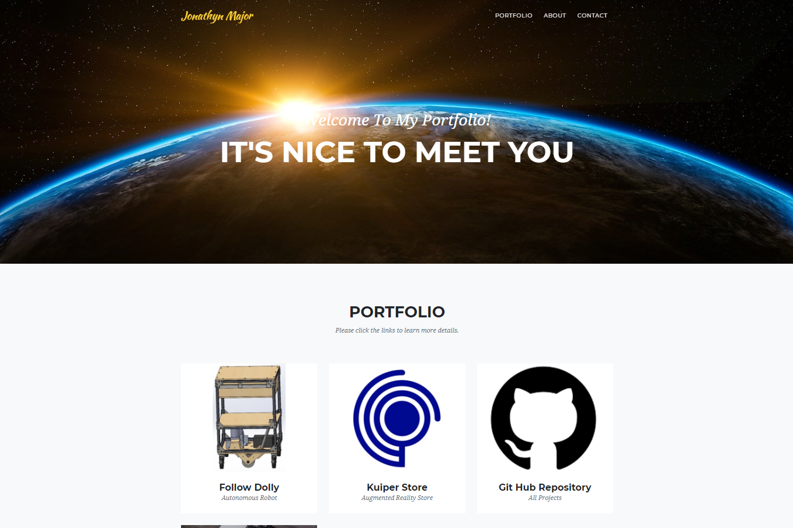

# UpdatedPortfilio
LINK: https://jonathynlee.github.io/UpdatedPortfilio/

## Table of Contents
---
1) Description
2) Using The Website
3) Additional Information

## Description
---
In this website you will find the my portfolio, it contains information about my 
professional and educational background. 

## Using the Website
---
The navigation (shown below), will take you to that section of the website automatically (no link, just scrolls)

In the portfolio section, you can click on one of the icons to open up a module that contains information pertainting to the title. 

The red arrows point to the exit points.

You can use the contact form to contact me.

The footer social media icons will connect to my social media account, please feel free to visit them.

## Additional Information
---
If you do not enter the correct information in the contact form, you will recieve an error. 

